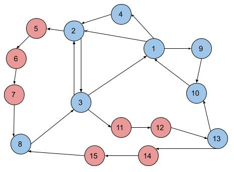
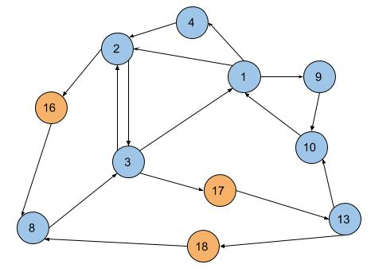
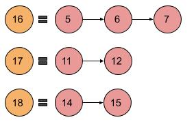

## Graph shrinker
This program shrinks a graph, excluding unnecessary vertices in graphs. For example, consider the following graph:


The red vertices can be replaced by a single vertex to reduce the graph size.


### data
In the data folder, there are small inputs (.in), which are not real, and also large inputs (.g), which are real.

Example of input:
G 3 4 2
N 1 0.0 0.0 2 2 0.9 3 0.8
N 2 1.0 1.0 1 3 1.3
N 3 2.0 2.0 1 1 9.0

The first line contains information about the graph (G): number of vertices, number of edges and maximum degree. 
This graph has 3 vertices, 4 edges and 2 as the maximum degree.

The next lines have information about each vertex (N): vertex id, latitude, longitude, number of neighbors, list of neighbors with neighbor id and the wight of the edge.
The vertex 1 has 2 neighbors, 2 and 3. The edge to vertex 2 has a weight of 0.9 and to 3, a weight of 0.8.


### usage

```
./shrink <input> <shrinked> <paths>
    <input> is the data
    <shrinked> is the name of the file with the input graph shrinked
    <shrinked> is the name of the file with shrinked paths


./shrink data/input1.in shrinked.out paths.out
```

For the graph above, which is the input1.in file, the outputs would contain:

shrinked.out:



paths.out:


